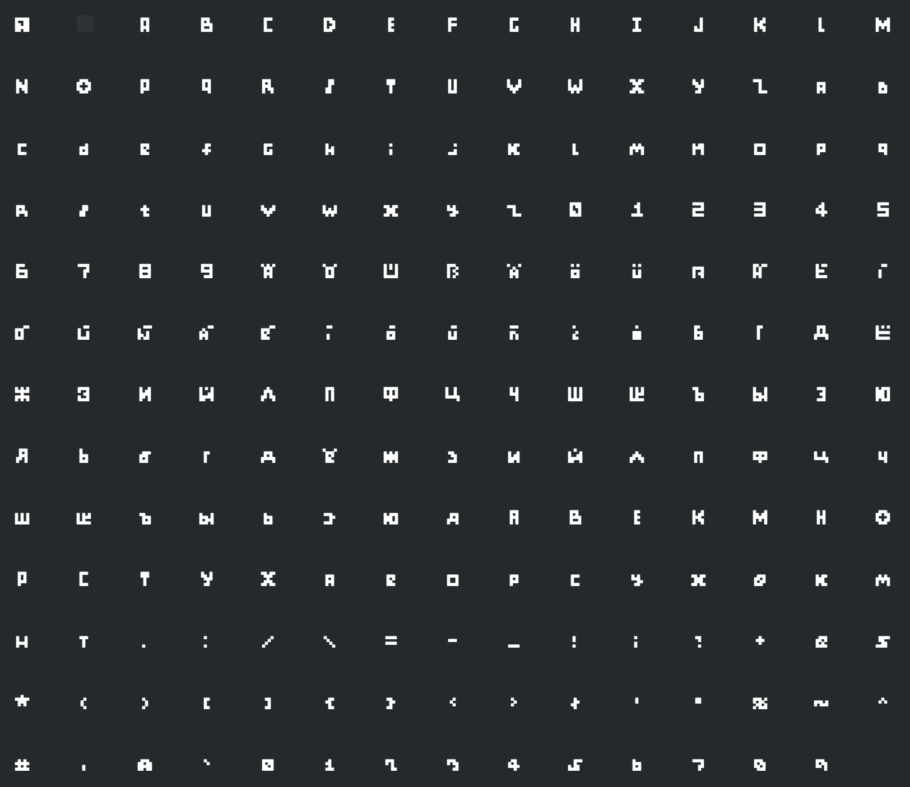
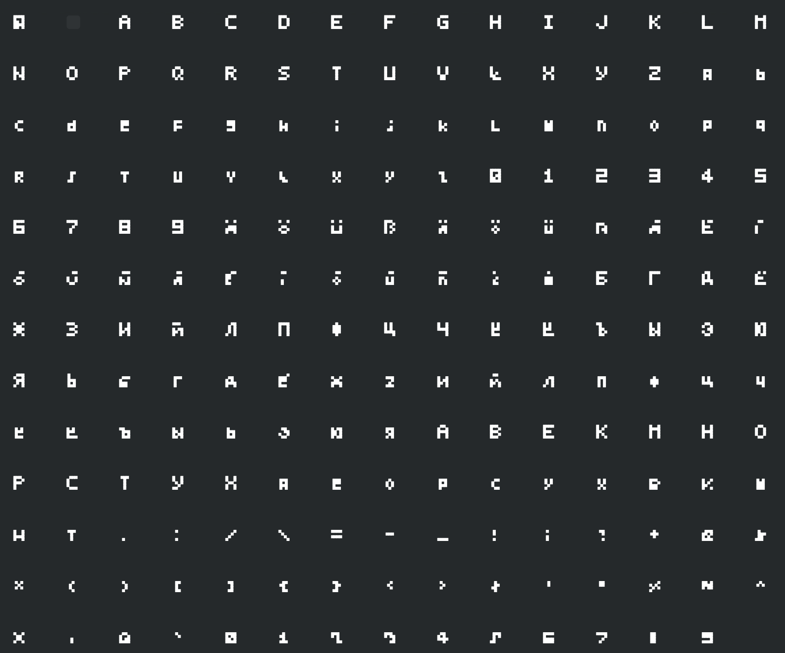
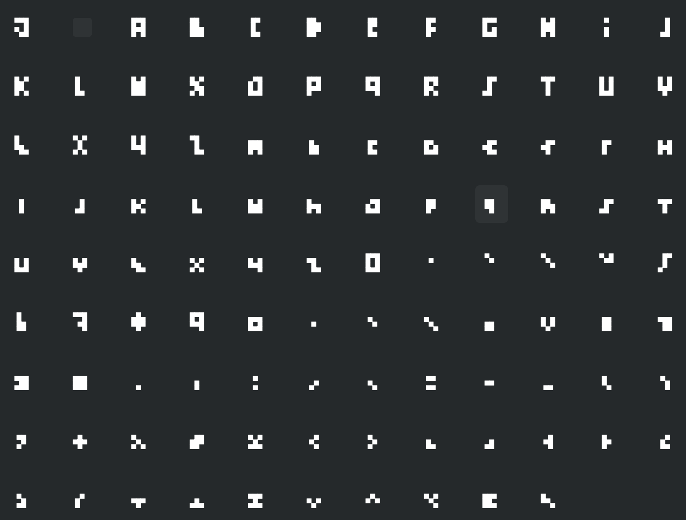
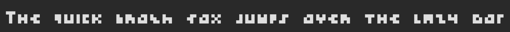
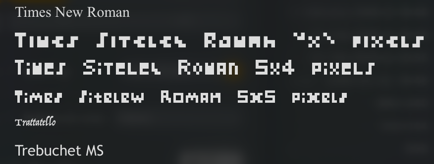

# Intro

This repo contains a family of extremely small fonts: 5x5, 5x4 and 4x3 pixels.

Useful for backups of important data on paper, metal, stone, etc.

If you want to use the fonts in your text editor, you can find the TTF files in the ttf_fonts dir.

But we recommend to render the images directly, to achieve the pixel-level quality. For this, you can use render_text.py in the tools dir, or our free [web tool](https://sideloading-research.github.io/extremely_small_font/).

# Fonts

## The 5x5 Font

The **5x5** font is the largest in the family, providing better readability for complex characters while remaining extremely compact. It uses a maximum bounding box of 5 pixels high and 5 pixels wide per character. 

We recommend to use this font, unless you have a strong reason to use an even smaller one.

It supports the characters for the following languages (and also all the key punctuation):

- English
- Spanish
- Russian
- German




## The 5x4 Font

The **5x4** font uses a maximum bounding box of 5 pixels high and 4 pixels wide per character. 

It supports the characters for the following languages (and also all the key punctuation): 

- English
- Spanish
- Russian
- German




## The 4x3 Font

The **4x3** font is the most extreme variation, compressing characters into a maximum 4 pixels high by 3 pixels wide grid, for maximum possible data density. This is likely the smallest possible font for English.

It supports only English / Latin characters, and the key punctuation.




## Font Preview

Here is how they might appear when installed on a system and viewed in a standard font list:



## Design considerations

Aside from the typical font design considerations, the both fonts are designed with a complete set of lower-case characters (including numbers!).

Thus, you can gain even more data density by converting your text into lower-case. Digits and punctuation will work as usual.

For the 4x3 font, the lower-case option will allow you to do 3x3 characters. An extreme data density!

If you use the render_text.py script, you can use the `--extreme` option for that.

E.g. 

```bash
python tools/render_text.py --text sample_data/human_rights_articles_1_3.txt --out output.png --size 4x3 --extreme
```

Note: by default, the characters legend is added to the output image. You can disable it with the `--no-legend` option.
